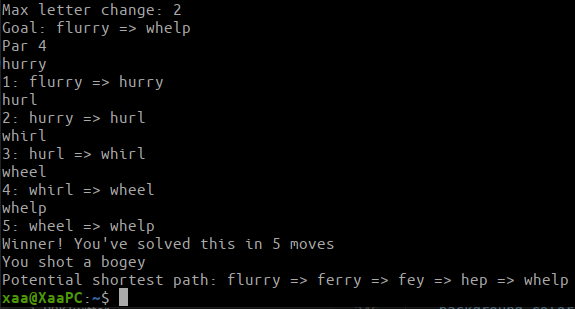

# Golfle
Read about it [here!](https://www.xaavian.com/golfle.html)\
\
(Web version coming soon)
## How to play
You must get from the starting word to the ending word by only making two changes to the word at a time to create a new word, in the fewest amount of moves as possible. A change is defined as either adding a letter, removing a letter, or changing a letter to another. For example, going from "infer" to "miner" would be a valid move with 2 changes (remove the "f", add a "m" at the start). You are given the minimal amount of moves it can be accomplished in, and are scored based on that. You are aiming for a par!\
\
You can start the game in normal mode (only 5 letter words are allowed) or in hard mode (any length word is acceptable) by running the game with either the `-normal` or `-hard` flags. (ex: `golfle -hard`)\
\

## How to build
On 64 bit Linux, you should be able to just run the executable with `./golfle`. On any other system, or if that doesn't work, you can build it easily if you have Go installed by running `go build -o golfle` in the main directory.
